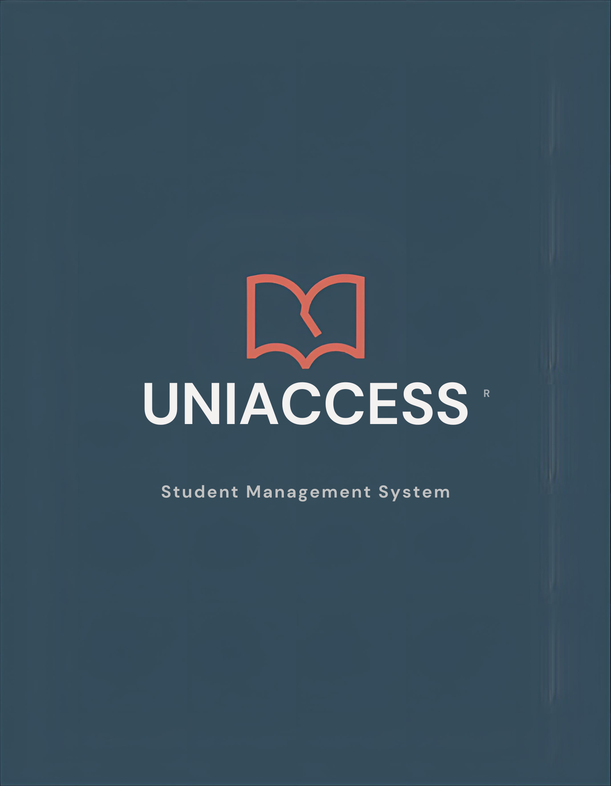

# 🌐 IT Group Project - 1030SEF

    <strong>UniAccess - A powerful student management system</strong>

    

> **Academic Management & Accessibility Portal**  
> *A modern, WCAG-compliant web application for seamless academic integration.*

---

## 🎯 Project Objective

The core mission of **1030SEF** is to bridge the gap between academic management and inclusive design. We have developed a high-performance web platform that centralizes essential student functions into one accessible interface.

### ✨ Key Features
- **Unified Dashboard:** One-stop access to **Academic Results**, **Attendance tracking**, and **Homework submissions**.
- **Secure Login System:** Robust authentication to ensure data privacy and student security.
- **Inclusion-First (WCAG):** A modern Graphical User Interface (GUI) meticulously designed to meet **WCAG standards**, ensuring full support for users with disabilities.
- **Maintainability:** Clean, well-commented code following industry best practices for future-proof development.

---

## 🛠️ Technology Stack

 

---

## 👥 Contributors (HKMU Team)

We are committed to delivering high-quality, inclusive software solutions.

| Contributor | Student ID |
| :--- | :--- |
| **Gong ZheKai** | `14131594` |
| **Yung Chak Wai** | `14268814` |
| **Yim Yan Kin** | `14256540` |
| **Hui Ho Ting Theo** | `14268851` |
| **Yu Ho Yip Tommy** | `14250640` |
| **Louie Cheuk Yin** | `14255831` |

---

## 🏗️ Technical Highlights

- **WCAG Standards:** Implemented high contrast ratios, screen reader support, and keyboard-only navigation.
- **Code Readability:** Every module includes inline documentation for "good readability and future maintenance" as per project requirements.
- **Responsive Design:** Optimized for various devices, from desktops to mobile tablets.

---

  Developed for <b>Internet Application Project (1030SEF)</b> @ HKMU

